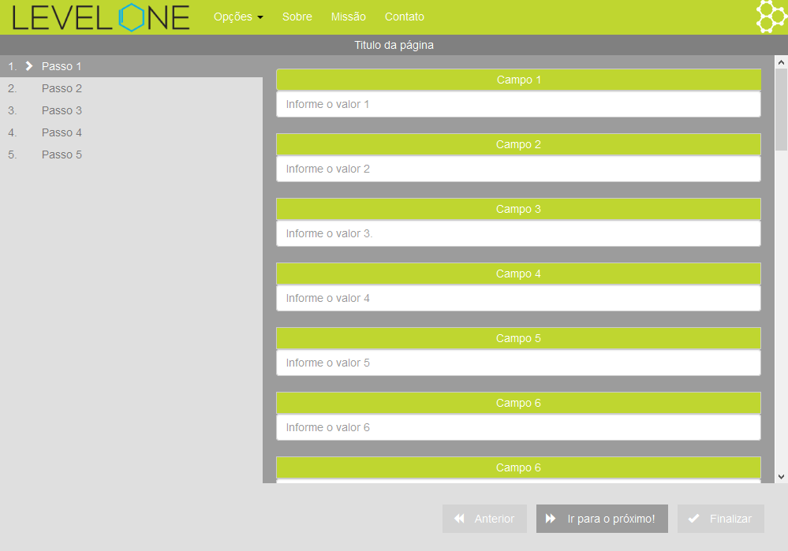

# NG-Steps



## Sobre:
Ng-Steps é uma versão aprimorada do JQuery Wizard. Tem como características:
- Completamente responsivo;
- Validação de formulário automatizada;
- Personalizável;
- Reutilizável;
- Permite inserção, remoção e ocultamento de abas de forma dinâmica.
- Não permite a troca de aba caso o formulário da aba atual esteja inválido, a menos que isso seja permitido.

Autoria: Leonardo Costa @ Level One Solutions

---

## Instalação:
O Ng-Steps depende do Bootstrap e do AngularJS 1.x para funcionar. Para ter o ng-steps pronto para uso no seu projeto, siga os passos:
1. Insira o arquivo **ng-steps.js** entre os arquivos do seu projeto web;
2. Insira o ng-steps como dependência no módulo em que será usado:
    ```js
        angular.module('app', ['ng-steps']);
    ```
3. Carregue o arquivo **ng-steps.js** no seu projeto, assim como suas dependências. Exemplo:
    ```html
    <!DOCTYPE html>
    <html ng-app="app">
        <head>
            <title>Um super WebApp</title>
            <meta charset="UTF-8">
            <meta name="viewport" content="width=device-width, initial-scale=1.0, maximum-scale=1.0, user-scalable=no">
            <link rel="stylesheet" href="libs/bootstrap.min.css">
            <link rel="stylesheet" href="style/style.css">
            <script src="libs/angular.min.js"></script>
            <script src="libs/ng-steps.js"></script>
            <script src="script/app.js"></script>
            <script src="script/controller.js"></script>
        </head>
        ....
    </html>
    ```

## Uso básico:

```html
<ng-steps vm="vm" titulo="vm.titulo" v-padding="70px">
    <step titulo="Passo 1" nao-validar liberado>
        Conteúdo do passo 1
        ...
    </step>
    <step titulo="Passo 2" nao-validar="false" liberado="false">
        Conteúdo do passo 2
        ...
    </step>
    <step titulo="Passo 3" mostrar="false">
        Conteúdo do passo 3
        ...
    </step>
</ng-steps>
```

## Atributos e descrição das diretivas:
- **ng-steps**: O container com o menu e controles.
  - **vm**: Um objeto no qual será armazenado o objeto com as configurações do steps. Exemplos: $scope ou vm;
  - **titulo**: Variável do `$scope` que define um texto para aparecer na barra de título do ng-steps;
  - **v-padding**: Por natureza o steps ocupa 100% do espaço disponível na tela, tanto vertical quanto horizontalmente. No entanto, é possível definir um espaço vertical para o uso de barra título / menu do site e rodapé, conforme a necessidade. 
- **step**: Uma seção de conteúdo.
  - **titulo**: Título da seção em texto plano. Se não especificado, o título será "Passo i" em que `i` é o índice da seção + 1.
  - **nao-validar**: Define se deve ser feita uma validação de formulário (html5) na seção. Se diferente de falso, o step aparecerá como válido independente da validade do formulário.
  - **liberado**: Define se é possível ir de uma seção para outra, mesmo que o formulário esteja inválido. Caso esteja, o step aparecerá como inválido.

---

## Configurando o steps:

Para configurar o steps, deve existir um objeto no $scope da tela no momento em que este for criado.

### Exemplo:
- No HTML:
```html
    <ng-steps vm="vm">...</ng-steps>
```
- No Controller:
```js
angular.module('myApp',[]).controller('ctrl', ['$scope', function($scope) {
    
    $scope.vm.steps = {
        btnProximo: 'Ir para o próximo!',
        stepCarregado: function () {
            alert('Hello World!');
        }
    };

}]);
```

### Atributos do objeto:
- **Botões**:
  - **btnAnterior**: Texto que aparecerá no botão de voltar;
  - **btnProximo**: Texto que aparecerá no botão de avançar;
  - **btnFinalizar**: Texto que aparecerá no botão de finalizar;

- **Comportamento**:
  - **todosLiberados**: Booleano que deixa todos os steps com o atributo `liberado`;
  - **finalizaVisivel**: Booleano que define se o botão finalizar estará sempre visível (true) ou apenas quando todos os formulários estão válidos (false);

- **Eventos**:
  - `stepMudando(indiceAtual : int, indiceProximo : int) : bool`  
    **Descrição**: Evento disparado antes de ocorrer a troca de um step para outro, independente da validade do formulário ou dos atributos `liberado` e `nao-validar`.  
    **Parâmetros**: Índice do step atual e índice do próximo step.
    **Retorno**: Se o retorno for falso, a troca de steps não acontecerá.

  - `stepMudado(indiceAtual : int, indiceProximo : int) : void`  
    **Descrição**: Evento disparado após ocorrer a troca de um step para outro.  
    **Parâmetros**: Índice do step atual e índice do próximo step.
  - `stepFinalizando() : bool`  
    **Descrição**: Evento disparado antes de ocorrer a finalização do steps, independente da validade dos formulários.   
    **Retorno**: Se retornar false, não será feita a finalização do steps. 

  - `stepFinalizado(validade : bool) : void`  
    **Descrição**: Evento disparado antes de ocorrer a finalização do steps, independente da validade dos formulários.  
    **Parâmetros**: Booleano que diz se todos os formulários estão válidos.

---

## Métodos de manipulação dos steps:
É possível manipular os steps pelo JavaScript, usando para isso os métodos no objeto de configurações. Todos os métodos estão na raíz do objeto.  

**Exemplo**: Avançando para o próximo step:
```js
    $scope.vm.steps.proximo();
```

- **CRUD**:
  - `inserir(html, titulo, naoValidar, liberado, indice)`  
    **Descrição**: Insere um novo step no `ng-step` em tempo de execução.   
    **Parâmetros**:  
        - html: conteúdo do step. Pode ser do tipo string, HTMLElement ou elemento JQuery;  
        - titulo: titulo do step, no tipo string;  
        - naoValidar e liberado: corresponde aos atributos do step nao-validar e liberado, tipo booleano;  
        - indice: em qual indice o step deve ser inserido, tipo int.
  - `remover(indice)`  
    **Descrição**: Remove o step no índice indicado.   
    **Parâmetros**: índice do step a ser removido  
- **Navegação**:
  - `proximo()`  
    **Descrição**: Avança para o próximo step, caso o atual não seja o último. 
  - `anterior()`  
    **Descrição**: Retrocede para o step anterior, caso o atual não seja o primeiro.  
  - `irPara(indice)`  
    **Descrição**: Vai para o step indicado pelo índice, desde que este exista  
    **Parâmetros**: Índice do step destino.  
- **Validação**:
  - `finalizarSteps()`  
    **Descrição**: Dispara o evento `stepFinalizando`, e se este não retornar `false`, causa a validação de todos os steps e disparo do evento `stepFinalizado`  
  - `validarStep(indice): bool`  
    **Descrição**: Causa a validação do formulário de um step em específico.  
    **Parâmetros**: indice do step a ser validado, tipo int.  
    **Retorno**: retorna se o step está válido ou não.
  - `validarTudo() : bool`  
    **Descrição**: Causa a validação de todos os steps.  
    **Retorno**: retorna true se todos os steps estiverem válidos e false caso contrário.

---

Desenvolvido por [Leonardo Costa](https://github.com/leonardoteck) e propriedade de [Level One Solutions](http://levelonesolutions.com.br).

**Uso restrito. Todos os direitos reservados.**